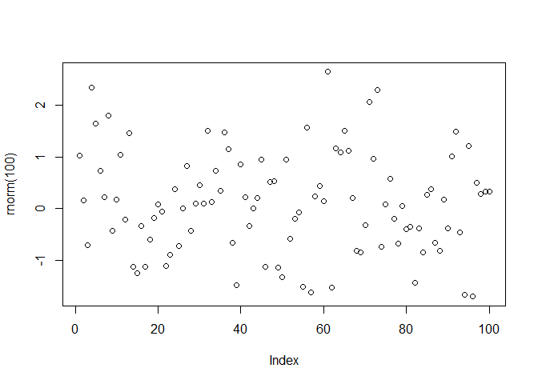

<!-- README.md is generated from README.Rmd. Please edit that file -->

# demopkg

<!-- badges: start -->

<!-- badges: end -->

The goal of `demopkg` is to to provide some demonstrations of R fnctions
and also vignettes.

## Installation

You can install the development version of demopkg from
[GitHub](https://github.com/rccline/demopkg) with:

``` r
devtools::install_github("https://github.com/rccline/demopkg")
```

## Example

This is a basic example which shows you how to solve a common problem:

``` r
library(demopkg)
M <- make_data() ## basic example code
```

What is special about using `README.Rmd` instead of just `README.md`?
You can include R chunks like so:

Use this code like this…

``` r
plot(rnorm(100))  # put in examples of the code here
```



You’ll still need to render `README.Rmd` regularly, to keep `README.md`
up-to-date.

You can also embed plots, for example:


In that case, don’t forget to commit and push the resulting figure
files, so they display on GitHub\!
